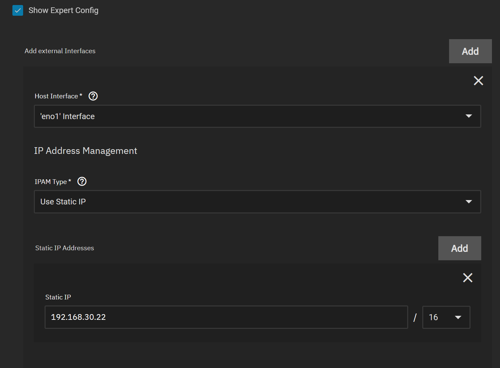
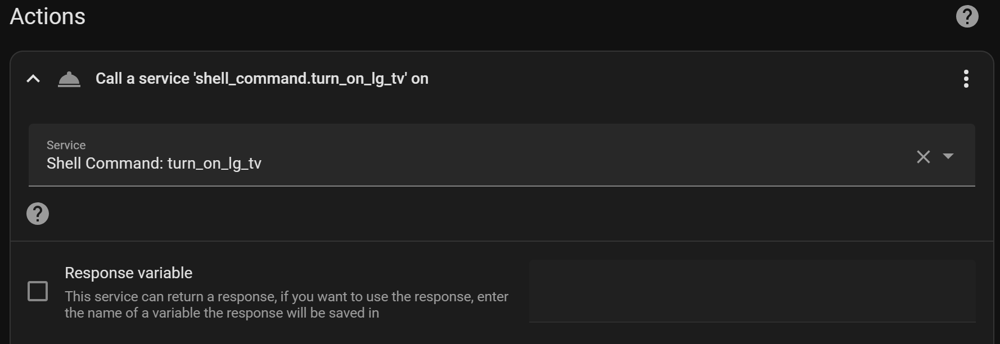

# Home Assistant

## Install
Install the TrueCharts version
No special configuration needed, but do install/enable the codeserver to easily edit the configuration files via the browser.
Some notes are on the Home Assistant documentation page for the [LG webOS Smart TV](https://www.home-assistant.io/integrations/webostv/#turn-on-action)
You also need to configure with a static ip under "Show Expert Config" and then add external interface 


## Configurations

### LG WebOS
The next steps do not seem to work consistently, look at the work-around section 
- In order to enable turning on the tv, you need to configure wake on lan
    - Install wake-on-lan by adding this line to /config/configuration.yaml 
		`wake_on_lan: # enables wake_on_lan domain`
-  Add the tv using the home assistent UI (Settings > Devices and Services > Add integration > LG > specify ip)
-  From the device create a new automation and select the Device is requested to turn on automation
-  In a code editor, go to /config/automations.yaml and specify the action sections as follows (make sure you specify mac and broadcast and leave the port set to 9!)

### Work-around wake-on-lan 
- Using the wake-on-lan service in home assistant doesn't work consistently, but it does work 100% of the time when run from the shell with the interface parameter specified
- Add the command below to the configuration.yaml
- Then use the command in a service "Shell Command: turn_on_lg_tv"  (see screen shot)


```
wake_on_lan: # enables `wake_on_lan` domain

# This will turn on the tv using wake-on-lan
# The hass magic packet service does not work in this container
# But wakeonlan does work if you specify the interface to use 
# This attemps to grab the iface ip automatically
shell_command:
  turn_on_lg_tv: "wakeonlan -n `awk '/32 host/ { print i } {i=$2}' /proc/net/fib_trie | grep -vE -m1  '^172.|^127.'` a8:23:fe:53:2a:ec"
```




```
- id: '1693074220430'
  alias: Netflix activity > TV on
  description: ''
  trigger:
  - platform: device
    device_id: 3c3aea8747519260d94518076e1f8837
    domain: select
    entity_id: e45d7eae7f43c73099d26a23ba18ec83
    type: current_option_changed
    from: power_off
    to: Netflix
  condition: []
  action:
  - service: shell_command.turn_on_lg_tv
    data: {}
  - delay:
      hours: 0
      minutes: 0
      seconds: 15
      milliseconds: 0
  - service: media_player.select_source
    data:
      source: Netflix
    target:
      device_id: f64083dd90aa2cec70f42ab2c4ee71c4
  - service: media_player.select_source
    data:
      source: TV Audio
    target:
      device_id:
      - 7b4205a4f8d5354944e0e7585e84bda3
      - d26bde1ae455f95aa0e4b262c8a86f5d
  mode: single
```