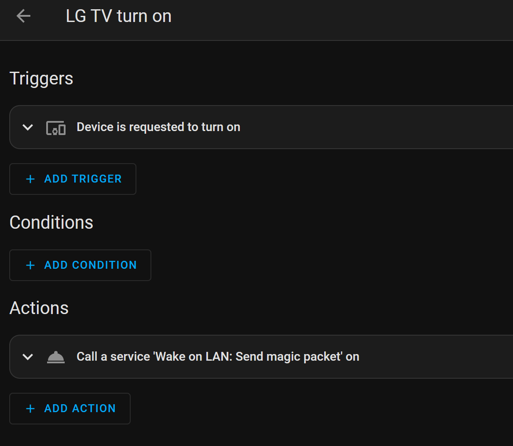

# Home Assistant

## Install
Install the TrueCharts version
No special configuration needed, but do install/enable the codeserver to easily edit the configuration files via the browser.
Some notes are on the Home Assistant documentation page for the [LG webOS Smart TV](https://www.home-assistant.io/integrations/webostv/#turn-on-action)

## Configurations

### LG WebOS
- In order to enable turning on the tv, you need to configure wake on lan
    - Install wake-on-lan by adding this line to /config/configuration.yaml 
		`wake_on_lan: # enables wake_on_lan domain`
-  Add the tv using the home assistent UI (Settings > Devices and Services > Add integration > LG > specify ip)
-  From the device create a new automation and select the Device is requested to turn on automation
-  In a code editor, go to /config/automations.yaml and specify the action sections as follows (make sure you specify mac and broadcast and leave the port set to 9!)
```
action:
  - service: wake_on_lan.send_magic_packet
    data:
        mac: <<mac address of tv here>>>
        broadcast_address: <<ip address of tv here>>
        broadcast_port: 9
```
- A complete example looks like this
```
- id: '1693057039259'
  alias: LG TV turn on
  description: ''
  trigger:
  - platform: device
    device_id: f64083dd90aa2cec70f42ab2c4ee71c4
    domain: webostv
    type: webostv.turn_on
  condition: []
  action:
  - service: wake_on_lan.send_magic_packet
    data:
      mac: <<mac address of tv here>>>
      broadcast_address: <<ip address of tv here>>
      broadcast_port: 9
  mode: single
```

-  Review the created automation by going to (s > Automations and Scenes), should look like this



