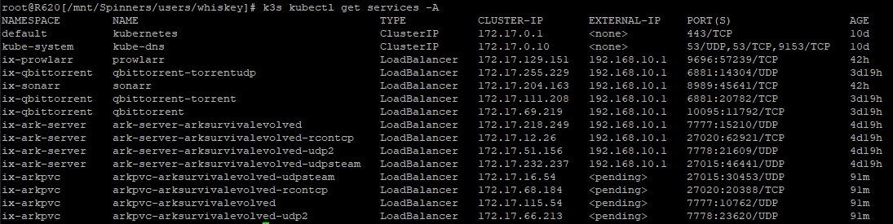
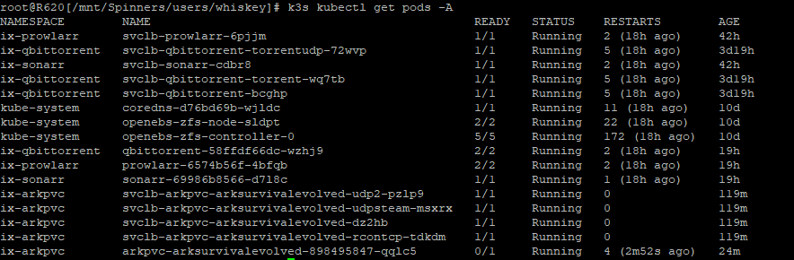
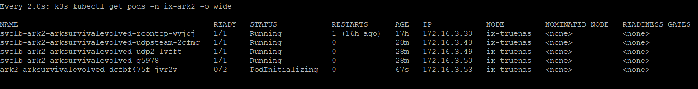
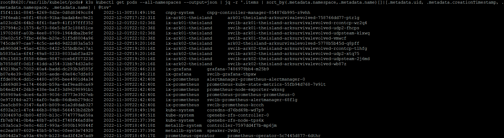

# Kubernetes

## Useful commands

### See what ports are in use by which pod
`k3s kubectl get services -A`

_Make sure the same port number is not used by multiple pods!_

### See what pods are deployed
`k3s kubectl get pods -A`

### Lots of details on the pods and containers
`k3s kubectl get pods,svc,daemonsets,deployments,statefulset,sc,pvc,ns,job --all-namespaces -o wide`

### See state of deployment of pods for given namespaces
`k3s kubectl get pods -n ix-ark2 -o wide`
Also useful with `watch` to see changes. 
When all pods are _READY_, the status in the GUI will go to _ACTIVE_ for the app.

### Check resource limits (e.g. to see what the memory limit is)
`k3s kubectl describe nodes`

### Check ports in use for given namespace or all namespaces

For namespace _ix-ark01-theisland_
`k3s kubectl get services -n ix-ark01-theisland --output=json | jq .items[].spec.ports[]`

For all namespaces
`k3s kubectl get services --all-namespaces --output=json | jq .items[].spec.ports[]`

### List all containerIDs of initContainer of all pods
Helpful when cleaning up stopped containers, while avoiding removal of initContainers.
`k3s kubectl get pods --all-namespaces -o jsonpath='{range .items[*].status.initContainerStatuses[*]}{.containerID}{"\n"}{end}' | cut -d/ -f3`

### List container IDs by namespace and name

`k3s kubectl get pods --all-namespaces --output=json | jq -r '.items | sort_by(.metadata.namespace,.metadata.name)[]|[.metadata.uid, .metadata.creationTimestamp, .metadata.namespace, .metadata.name] | @tsv'`

To find orphaned pods, check pods in _/var/lib/kubelet/pods_

`k3s kubectl get services -n ix-ark02-theisland --output=json | jq -r ' ["name", "nodePort", "port", "protocol", "targetPort"],  (.items[] | .spec.ports[] | [.name, .nodePort, .port, .protocol, .targetPort]) | @tsv'`

`k3s kubectl get services -n ix-calibre --output=json | jq -r ' ["name      ", "nodePort", "port", "targetPort", "protocol"], (.items[] | .spec.ports[] | [(.name | . + " " * (10 - length)), (.nodePort | tostring | . + "    "), .port, (.targetPort | tostring | . + "     "), .protocol]) | @tsv'`

`k3s kubectl get services --all-namespaces --output=json | jq -r ' ["name      ", "nodePort", "port", "targetPort", "protocol"], (.items[] | .spec.ports[] | [(.name | . + " " * (10 - length)), (.nodePort | tostring | . + "    "), .port, (.targetPort | tostring | . + " " * (10 - length)), .protocol]) | @tsv' `

### Show logs in the terminal or enter container shell
More on Kubernetes logs [here](https://sematext.com/blog/tail-kubernetes-logs/)
To follow logs in the terminal, first find the podname and namespace with `k3s kubectl get pods --all-namespaces`, then run
`k3s kubectl logs podname -n namespace -f`

To get a shell in the container:
`k3s kubectl exec -it podname -n namespace -- /bin/bash`

### Get everything in a namespace
Useful to see what pods services (ports) etc. are in use
`k3s kubectl get all -n namespace`