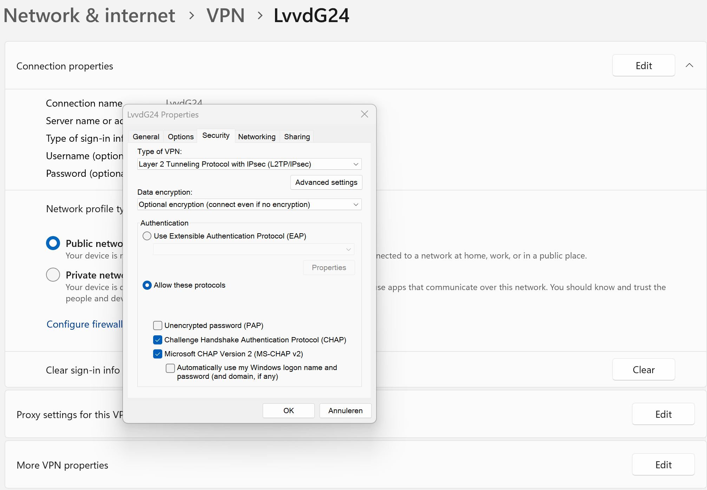
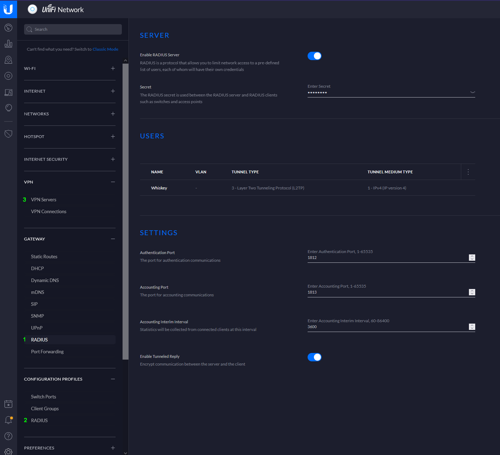

# VPN setup with UniFi Secure Gateway

## Introduction
This describes how to setup a VPN connection to your LAN using the RADIUS server that the UniFi Secure Gateway (USG) offers. The purpose is to be able to access your servers as if you were at home without poking lots of holes in your firewall and/or exposing your servers to the internet.

### 1. Enable the RADIUS server
1. Go to Settings > Gateway > RADIUS
1. Enable the RADIUS server and enter a secret password
1. Leave the ports to their defaults (1812, 1813 and 3600) and leave _Enable Tunneled Reply_ enabled
1. Create a new user (button is bottom right, below the Settings section)
* Enter a password (can be the same as the RADIUS password for convenience)
* Leave VLAN ID empty
* For Tunnel Type, select `3 - Layer Two Tunneling Protocol (L2TP)`
* For Tunnel Medium Type, select `1 - IPv4 (IP version 4)`

## 2. Configuration Profile
* Just use the default one that is already there 
* Leave the _Enable Wired_ and _Enable Wireless_ turned offers

## 3. Setup VPN server
1. Enter a name for the this VPN and enable it
1. For _VPN Type_, select `L2TP Server`
1. Enter a _Pre-Shared Key_ (just use the earlier password again)
1. For the _Gateway IP/Subnet_ enter a range that does not clash with your local network **or with a Kubernetes network on a server you want to access!** So not `172.16.0.0/16` which is the range offered by default (if you use that, access to your TrueNAS Scale server will not work!). See details in [this forum thread](https://www.truenas.com/community/threads/unable-to-access-truenas-over-vpn.103341/post-711275).
1. Leave the DHCP and Radius Settings on their default (all disabled, including MS-CHAP v2)

## 4. Reboot USG
Not sure if its needed, but not taking chances anymore.

## 5. Configure VPN client side
For an Android VPN connection, go to _Settings > Wifi and network > VPN_  and add a new VPN profile, then:
* Name: _any name_
* Type: `L2TP/IPSec PSK`
* Server address: _your internet facing IP of the USG_
* L2TP-secret: _leave empty_ 
* IPSec-ID: _leave empty_
* Pre-shared key: _key created earlier_
* DNS search domains: _leave empty_
* DNS servers: _leave empty_
* Forwarding routes: _internal local network range_ (e.g. `192.168.0.0/16`)
* Proxy: _none_
* Username and Password: _as configured earlier_

## 5b. Configure VPN client side
* On Windows 11, make sure these protocols are enabled under Security (under "More VPN properties"):

* You also need this regedit as described [here on superuser](https://superuser.com/questions/1298513/l2tp-ipsec-vpn-fails-to-connect-on-windows-10-works-fine-on-ios):

`REG ADD HKLM\SYSTEM\CurrentControlSet\Services\PolicyAgent /v AssumeUDPEncapsulationContextOnSendRule /t REG_DWORD /d 0x2 /f`

## 6. Port forwarding
If the USG is behind a router or firewall, forward these ports:
* TCP 1701
* TCP 1812-1813
* UDP 500 (not sure if needed)
* UDP 4500 (not sure if needed)

